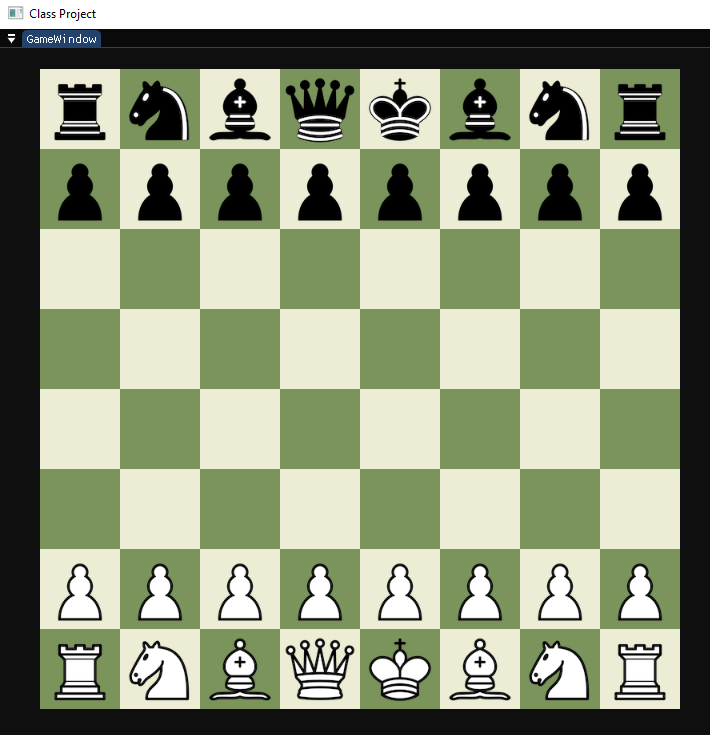
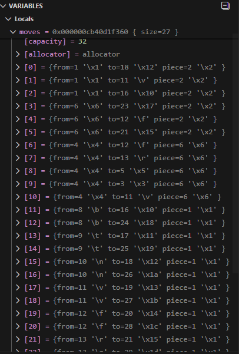

# Chess - CMPM 123 - Noah Baron

Current implementation for this project has a setup chessboard based on FEN strings, and move generation and captures for pawns, knights, and bishops. The move generation is based on runtime compiled bitboards, using preset move calculations, and then testing to see if those moves are available for the user to make. 

Updated implementation by adding moves for Bishops, Rooks, and Queens. This was accomplished by utilizing the provided magicBitboards.h file to have precomputed bitboards for the moves. These will allow move computations to be far faster, and will benefit the game a lot when it comes to implementing an AI player. These move generators primarily utlize magicBitboards functions to determine if moves are valid, and it will add all valid moves to the move array.

This was developed on Windows 10. 
